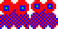
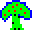
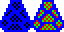

Labyrinth
=========

A version of Acornsoft Labyrinth written in C# and using the Microsoft XNA kit.

The original author was Michael Mathison, and it was released for the BBC Micro in 1984.

It aims to be pretty accurate to the original, for example the sprites and sounds are all taken from the original game.

Thanks to Bob Nystrom and http://gameprogrammingpatterns.com

